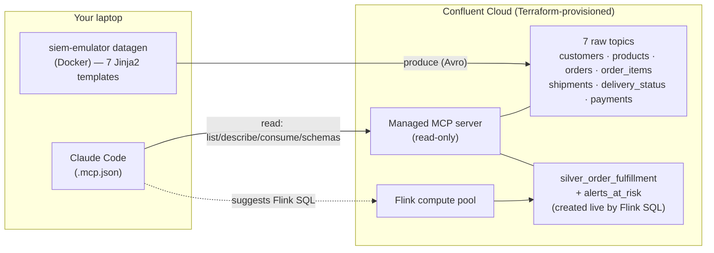
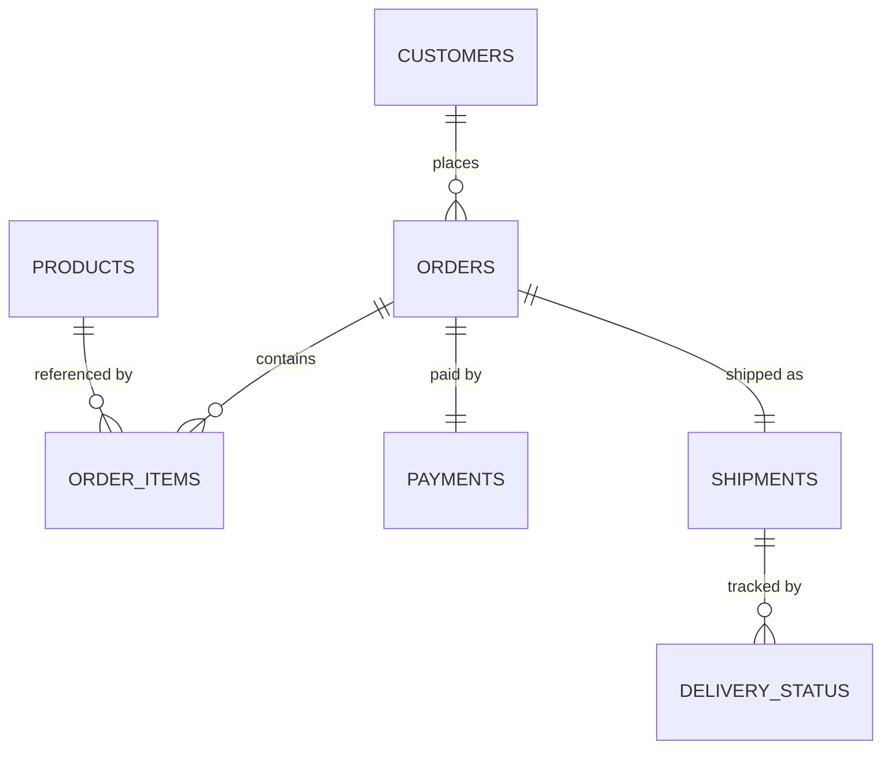

# DSWT London 2026 — Claude Code × Confluent Cloud

A live demo showing **Claude Code** reading real Kafka streams from
**Confluent Cloud** through the **managed MCP server**, discovering the
relationships between them, and **suggesting the Flink SQL** to build new data
products on top — raw → bronze → silver, an at‑risk detector, and an executive
summary.

> **The pitch:** data streams are a better foundation to build from — and this is
> how a data scientist or architect explores and productizes a stream without
> leaving their terminal.

---

## Architecture



- **Terraform** provisions the environment, cluster, Flink pool, the 7 raw
  topics, service accounts, RBAC and API keys.
- **Datagen (Docker)** pumps the seven related e‑commerce streams into Confluent
  Cloud. Avro schemas auto‑register.
- **Claude Code** connects to the **managed MCP server** (read‑only) to explore,
  and **suggests** the Flink SQL. The presenter applies it on the Flink pool.

The managed MCP server is read‑only by design (`list_kafka_topics`,
`describe_kafka_topic`, `consume_kafka_messages`, `list_schema_subjects`,
`read_schema_subject`) — so creating topics / running Flink is the presenter's
job, driven by what Claude proposes.

---

## The data (what Claude will discover)

Seven streams with real referential integrity, so the joins reconcile exactly:

| Topic | Kind | Key | Links via |
|---|---|---|---|
| `dswt_customers` | dimension (compacted, 1000) | `customer_id` | — |
| `dswt_products` | dimension (compacted, 100) | `product_id` | — |
| `dswt_orders` | fact | `order_id` | `customer_id` → customers |
| `dswt_order_items` | fact (fan‑out, 2–5 rows/order) | `order_id` | `order_id` → orders, `product_id` → products |
| `dswt_shipments` | fact (the promise) | `order_id` | `order_id` → orders |
| `dswt_delivery_status` | fact (stateless status events, lifecycle/order) | `order_id` | `order_id` → orders/shipments |
| `dswt_payments` | fact | `order_id` | `order_id` → orders |

Three deliberately discoverable relationships make the "wow" land — all exact:

- **`order_items.unit_price == products.unit_price`** for the joined `product_id`.
- **`Σ order_items.line_total == orders.order_total`** per `order_id` (each order
  fans out into a random 2–5 line items that sum to its total).
- **`payments.amount == orders.order_total`** for the same `order_id`.

They come from seeded, deterministic helpers in `siem_producer.py`
(`seeded_integer` / `seeded_floating` / `seeded_choice`): every line item is a
pure function of `(order_id, line)`, so independent producer processes derive
identical values from a shared key and the totals reconcile across topics — see
the shared item model documented in `templates/dswt_orders.j2`. ~1 in 10 payments
are `DECLINED`, which feeds the at‑risk detector.

**Delivery is modelled the event‑driven way.** `dswt_shipments` carries the
promise (`promised_days`, `shipped_ts`); `dswt_delivery_status` is a *stateless*
event stream that only reports statuses as they happen
(`CREATED → IN_TRANSIT → OUT_FOR_DELIVERY → DELIVERED`, with a real `event_ts`).
It never carries `actual_days` or `is_late` — **lateness is computed in Flink**
(silver) by comparing the `DELIVERED` event time to `shipped_ts + promised_days`.
~1 in 6 orders arrive late. Timestamps are deterministic from `order_id`, so the
two independent producers agree and the delivery durations are real.

**Referential integrity comes from a bounded, closed keyspace** — not a
coordinator. There are exactly 1000 customers, 100 products (both bulk‑loaded
before any order flows), and `NUM_ORDERS` orders; every child references an id
inside those bounds, and each producer runs `-n` and stops at its limit, so
nothing is ever orphaned. Fan‑out streams get an exact `-n`: `order_items` = the
deterministic sum of `item_count`, and `delivery_status` = `4 × NUM_ORDERS`.

### Real-time flow and volume

The flow is sized by two knobs: `ORDERS_PER_SEC` (default **5**) and `RUN_HOURS`
(default **24**), giving `NUM_ORDERS = ORDERS_PER_SEC × RUN_HOURS × 3600` =
**432,000**. The five fact streams flow at **rate‑matched** speeds so they
progress through the order keyspace together, then stop at ~24h:

| Topic | Messages | Rate | Formula |
|---|---:|---:|---|
| `dswt_customers` | 1,000 | bulk | fixed (loaded first) |
| `dswt_products` | 100 | bulk | fixed (loaded first) |
| `dswt_orders` | 432,000 | 5/s | `NUM_ORDERS` |
| `dswt_order_items` | 1,512,947 | 17/s | Σ `item_count` (2–5), avg 3.502/order |
| `dswt_shipments` | 432,000 | 5/s | `NUM_ORDERS` |
| `dswt_delivery_status` | 1,728,000 | 20/s | `4 × NUM_ORDERS` |
| `dswt_payments` | 432,000 | 5/s | `NUM_ORDERS` |
| **Total** | **4,538,047** | ~47/s | |

The `order_items` count is exact and reproducible — the entrypoint computes
`Σ item_count` with the same seeded helper the template uses. Override
`ORDERS_PER_SEC`, `RUN_HOURS`, or `NUM_ORDERS` to change throughput/duration
(e.g. `NUM_ORDERS=5000 docker compose up` for a quick test run).



---

## Prerequisites

- Terraform ≥ 1.5, Docker, and a Confluent Cloud account.
- A **Cloud API key** (OrganizationAdmin/EnvironmentAdmin) for Terraform.
- Claude Code, run from the **repo root** (where `.mcp.json` lives).

---

## Act 0 — Setup (off stage, ~10 min + a few min for data)

### 1. Provision Confluent Cloud

```bash
cd demo/DSWT-London-2026/terraform
cp terraform.tfvars.example terraform.tfvars      # adjust cloud/region if needed
export CONFLUENT_CLOUD_API_KEY="..."              # provider auth (env, not on disk)
export CONFLUENT_CLOUD_API_SECRET="..."
terraform init
terraform plan
terraform apply
```

Terraform writes everything the demo needs (all git‑ignored):

- `kafka/cc-kafka.properties` + `kafka/cc-sr.properties` at the repo root, and
- **`demo/DSWT-London-2026/.env`** — the datagen CC connection plus the Claude MCP
  **endpoint** (`DSWT_CC_MCP_URL`). The MCP **token** (`DSWT_CC_MCP_AUTH`) is *not*
  written by Terraform — you set it yourself from a Global API key (see step 3).

`terraform output flink_compute_pool_id` gives the pool id for the Flink SQL step.

### 2. Start the datagen (Docker)

```bash
cd .. # Go back to demo/DSWT-London-2026
docker compose up --build      # reads the Terraform-generated .env
```

It **bulk-loads the dimensions first** (1000 customers + 100 products), then
**streams the facts in real time** — ~5 orders/sec (with their order_items,
shipments, delivery-status lifecycle and payments at rate-matched speeds) for
~24h, then stops. Every producer walks the same closed `order_id` keyspace
`[0, NUM_ORDERS-1]` and stops at its limit, so no child is ever orphaned (its
order/customer/product is in the set). Tune with `ORDERS_PER_SEC` / `RUN_HOURS`
(see the volume table above). Leave it running for the event — the topics keep
flowing so the demo shows live data.

### 3. Point Claude Code at the managed MCP server

The `cc-managed-mcp` server is declared in the **repo‑root `.mcp.json`** (Claude
Code reads project MCP config only there — not from `.claude/`). It's generic and
resolves from two env vars:

```jsonc
"cc-managed-mcp": {
  "type": "http",
  "url": "${DSWT_CC_MCP_URL}",                        // regional, cluster-scoped endpoint
  "headers": { "Authorization": "Basic ${DSWT_CC_MCP_AUTH}" }
}
```

- **`DSWT_CC_MCP_URL`** — Terraform builds and writes this into `.env`. It's the
  **regional, cluster-scoped** endpoint:
  `https://mcp.<region>.<cloud>.confluent.cloud/mcp/v1/context-engine/organizations/<org>/environments/<env>/kafka-clusters/<lkc>`
- **`DSWT_CC_MCP_AUTH`** — **you set this yourself** (Terraform does not generate
  it). It's `base64(<key>:<secret>)` of a **Global API key** in Confluent Cloud.
  Create one for the `mcp-reader` service account Terraform made
  (`terraform output mcp_reader_service_account`) so it inherits the read‑only
  RBAC:

  ```bash
  # Console: Cloud API keys → Add key → Global → owner = the mcp-reader SA
  # then base64 it and export:
  export DSWT_CC_MCP_AUTH="$(printf '%s:%s' <GLOBAL_KEY> <GLOBAL_SECRET> | base64)"
  ```

Claude Code expands `${VAR}` in both `url` and `headers`. Source `.env` (URL) and
export the auth, then launch from the repo root:

```bash
set -a; source demo/DSWT-London-2026/.env; set +a       # sets DSWT_CC_MCP_URL
export DSWT_CC_MCP_AUTH="$(printf '%s:%s' <GLOBAL_KEY> <GLOBAL_SECRET> | base64)"
claude
```

Project MCP servers need approval on first run — approve `cc-managed-mcp` when
prompted (or set `"enableAllProjectMcpServers": true` in `.claude/settings.json`
to skip the prompt for rehearsals). Verify:
> *"Using cc-managed-mcp, list the topics on the cluster."*

You should see the seven `dswt_*` topics.

---

## The demo (Acts 1–4)

Exact prompts to type into Claude Code. (Tell it to use `cc-managed-mcp`.)

### Act 1 — Discovery
> *"You have read‑only access to a Confluent Cloud cluster via the cc-managed-mcp
> server. List the topics, look at a few sample messages and the schemas, and
> tell me what business this data is from and what each stream represents."*

Claude enumerates the topics, consumes samples, reads schemas, and infers an
e‑commerce order‑management domain — from the raw streams alone.

### Act 2 — Relationships
> *"Find the relationships between these streams. What are the join keys? Draw the
> data model as a mermaid ER diagram, and check whether any fields reconcile
> across streams."*

Claude identifies `order_id` and `customer_id`/`product_id`, draws the ERD, and
(the money moment) notices **`payments.amount` equals `orders.order_total`** and
**line prices match the product catalog**.

### Act 3 — Build the data products (Claude suggests → presenter applies)
> *"I want a raw → bronze → silver pipeline on Confluent Cloud Flink. Suggest the
> Flink SQL to clean and dedupe these into bronze tables, then a silver
> `silver_order_fulfillment` table that joins orders + payments + shipments +
> delivery status, enriches with the customer dimension, and **computes lateness**
> (compare the DELIVERED event time to shipped_ts + promised_days — the delivery
> stream itself never says whether it was late). Also suggest an at‑risk detector for
> declined payments and late deliveries."*

Apply Claude's SQL on the Flink pool (pre‑tested fallbacks live in `flink/`):

```bash
# In the Confluent Cloud console → Flink → your pool, set the context first:
#   USE CATALOG `<env display name>`;  USE `<cluster display name>`;
# Then run the files in order: bronze.sql → silver.sql → anomalies.sql
```

Run each statement **separately** — every `CREATE TABLE` first, then each
`INSERT INTO` (which starts a *continuous* streaming job that never "finishes",
so it won't block the next one only if submitted as its own statement). Or use
the CLI (`confluent flink shell --compute-pool <id> --environment <id>`).

**Close the loop** back in Claude:
> *"Using cc-managed-mcp, consume a few messages from `silver_order_fulfillment`
> and confirm the enrichment worked."*

The read‑only MCP now sees the brand‑new product the presenter just created.

### Act 4 — Executive summary (the closer)
> *"Consume recent data from `silver_order_fulfillment` and write a short weekly
> executive summary: order volume, revenue, % late deliveries, % declined
> payments, and anything notable by channel or customer segment."*

Optionally apply `flink/exec_summary.sql` first so the headline numbers are exact.

---

## Fallbacks (live‑with‑a‑net)

- **Pre‑tested SQL** in `flink/` — apply directly if a live suggestion needs a fix.
- **Infra already applied** — never run `terraform apply` on stage.
- **Screen recording** of a full clean run, in case the venue network fails.
- **Safe mode:** the repo's local OSS‑MCP demo (`demo/AI-demo/`) runs entirely
  offline against a local cluster if Confluent Cloud is unreachable.

## Rehearsal checklist

- [ ] `terraform apply` clean; outputs captured.
- [ ] `docker compose up` — all seven topics have data in the CC console.
- [ ] `DSWT_CC_MCP_AUTH` exported; Claude lists the seven topics via `cc-managed-mcp`.
- [ ] `payments.amount == orders.order_total` verified live (Act 2).
- [ ] `bronze → silver → anomalies` apply cleanly on the pool.
- [ ] MCP re‑reads `silver_order_fulfillment` (Act 3 loop).
- [ ] Full Acts 1–4 run on the clock; recording captured.

## Teardown

```bash
cd demo/DSWT-London-2026 && docker compose down
cd terraform && terraform destroy
```

(If `destroy` says "no changes" but resources still exist, run `terraform init`
first — a config edit can require re-init before the state is readable.)

## Re-provisioning (destroy → re-apply) and reconnecting Claude

`terraform destroy` then `apply` creates a **new environment + cluster**, so the
`<env>`/`<lkc>` in `DSWT_CC_MCP_URL` change (org/region/cloud stay the same).
Terraform re-writes `.env` with the new URL, but:

- **Claude does not auto-reconnect.** It expands `${DSWT_CC_MCP_URL}` at *launch*,
  so a running session keeps the old endpoint even after `.env` changes. **Exit
  Claude, re-source the new `.env`, and start `claude` again.**
- **No re-approval needed** — `.mcp.json` text is unchanged (it's `${VAR}`), so the
  project-server approval persists across re-applies.
- **Global API key:** if you created it for the Terraform-managed `mcp-reader` SA,
  `destroy` deletes that SA and invalidates the key — you'd make a new one. **To
  avoid this every cycle, create the Global key for a *persistent* principal** (your
  user, or a long-lived SA outside this Terraform); then only the URL changes.
- **Datagen restart only** (`docker compose down && up`) does **not** change the
  cluster/URL — Claude stays connected; nothing to do.

## Security notes

- `.env`, `kafka/cc-*.properties`, `terraform.tfvars`, and Terraform state are
  git‑ignored — keep the filled‑in versions off git.
- The MCP reader is a least‑privilege, read‑only service account.
- Rotate/destroy the demo API keys after the event (`terraform destroy` removes
  the service accounts and keys).

## Files

```
demo/DSWT-London-2026/
├── README.md                 # this runbook
├── .env                      # generated by Terraform (git-ignored)
├── docker-compose.yml        # runs the datagen against Confluent Cloud
├── docker/
│   ├── Dockerfile            # datagen image (build context = repo root)
│   └── entrypoint.sh         # bulk-loads dims, runs the 5 fact streams
├── terraform/                # env · cluster · Flink pool · topics · RBAC · keys
│   ├── providers.tf  vars.tf  main.tf  outputs.tf  terraform.tfvars.example
└── flink/                    # suggested + pre-tested Flink SQL
    ├── bronze.sql  silver.sql  anomalies.sql  exec_summary.sql
```

Datagen internals (templates, seeded helpers) live at the repo root:
`templates/dswt_*.j2`, `templates/data/*`, `siem_producer.py`.
